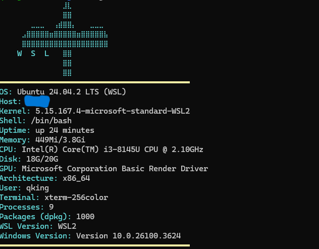

# Lightfetch
A lightweight general systeminformation tool written in C.

# 🌟 lightfetch

A lightweight system information display utility for Unix-like systems that quickly shows your system's vital statistics in a clean, customizable format.

<p align="center">
  
</p>

## Features

- 🚀 Fast and minimal resource usage
- 💻 Displays OS, kernel, uptime, and hardware information
- 🎨 Clean, customizable ASCII art logo
- 🔌 WSL detection and Windows host information
- 🧰 Compatible with most Linux distributions, macOS, and BSD systems

## Installation

### Prerequisites

- C compiler (GCC or Clang)
- Make
- (Optional) pkg-config and required libraries for additional features

### Building from source

```bash
# Install C build tools
# For Debian/Ubuntu
sudo apt install build-essential pkg-config

# For Fedora/RHEL
sudo dnf install gcc make pkg-config

# For Arch Linux
sudo pacman -S base-devel

# Clone the repository
git clone https://github.com/QKing-Official/lightfetch.git
cd lightfetch

# Build the project
make

# Install system-wide
sudo make install
```

### Running

```bash
lightfetch
```

## Contributing

Contributions are welcome! Please feel free to submit a Pull Request.

## License

This project is licensed under the MIT License - see the LICENSE file for details.

## Acknowledgments

- Inspired by [neofetch](https://github.com/dylanaraps/neofetch) and other system information tools
